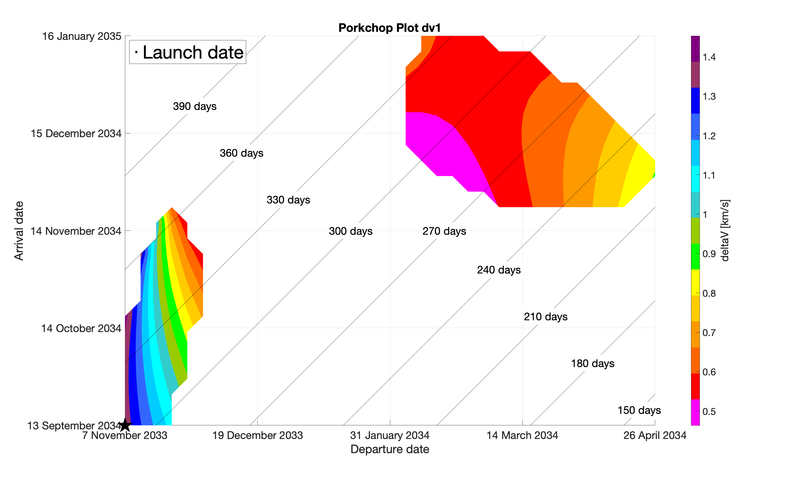
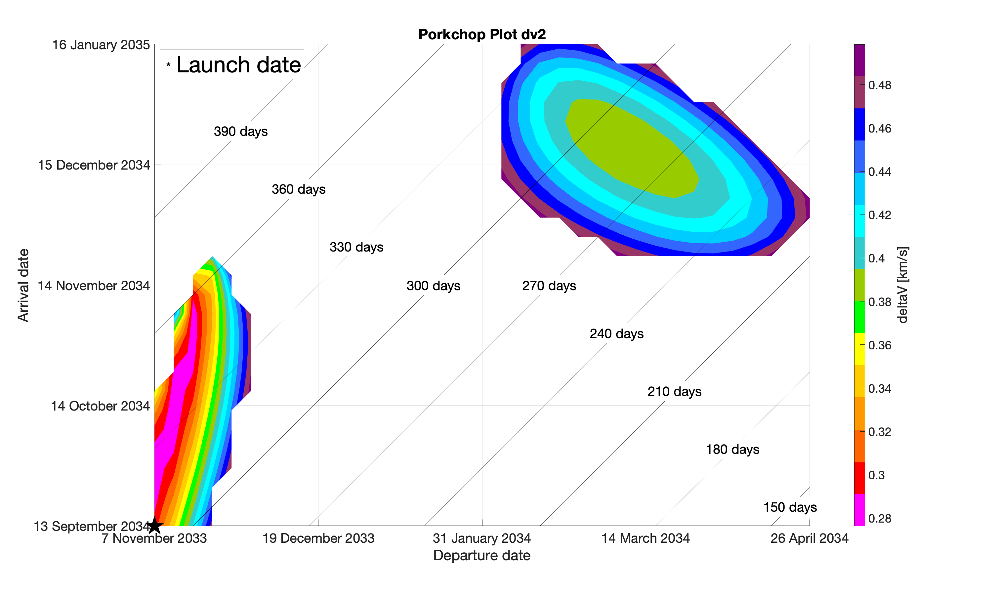
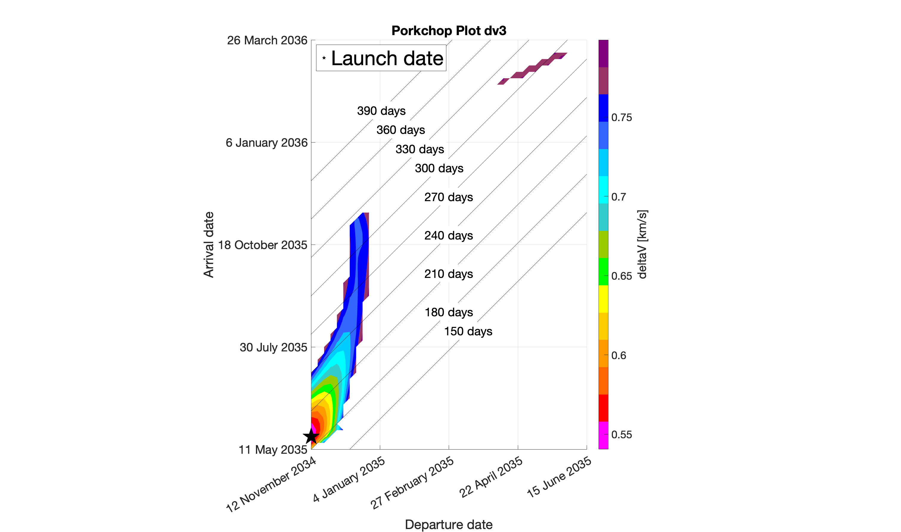
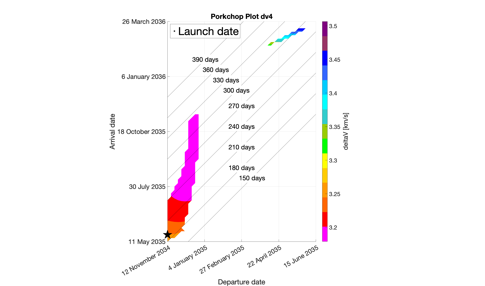
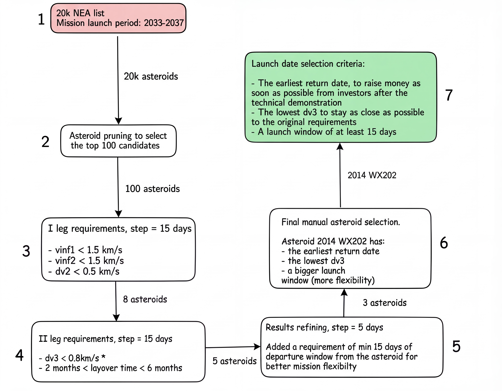

# Asteroid Mining Tech Demo: Trajectory Design Analysis


## 📌 Abstract
This repository contains the solution for **Assessed Exercise 3** of the *Programming and Mathematics for Astrodynamics and Trajectory Design (2024-2025)* module.

The project involves a grid search for asteroid sample return opportunities for commercial nanosatellite demonstrators. The mission targets Near-Earth Asteroid (NEA) mining, specifically identifying **Asteroid 2014 WX202** as the optimal candidate. Transfer trajectories between early 2033 and the end of 2037 were analyzed to meet strict hyperbolic excess velocity and rendezvous maneuver constraints.

## 🎯 Mission Requirements
*   **Launch Window:** Jan 1, 2033 – Dec 31, 2037.
*   **Mission Profile:** Earth $\to$ Asteroid (Stay 2-6 months) $\to$ Earth.
*   **Constraints:**
    *   Departure/Arrival $v_{\infty} < 1.5$ km/s.
    *   Rendezvous maneuvers $\Delta v < 500$ m/s.

---

## 🏆 Results

The analysis identified **Asteroid 2014 WX202** as the prime candidate for the sample return mission. The optimal mission profile requires a **Total $\Delta v$ of 5.477 km/s** and spans a total duration of **560 days** (approx. 1.5 years).

| Mission Event | Date (MJD2000) | Date (Gregorian) | Time (days) | $\Delta v$ (km/s) |
| :--- | :--- | :--- | :--- | :--- |
| **Earth Departure** | 12363.5 | 05 Nov 2033 | 0 | 1.391 |
| **Asteroid Arrival** | 12673.5 | 11 Sep 2034 | 310 | 0.299 |
| **Scientific Operations** | — | — | 60 | 0.000 |
| **Asteroid Departure** | 12733.5 | 10 Nov 2034 | — | 0.541 |
| **Earth Return** | 12923.5 | 19 May 2035 | 190 | 3.247 |

### Porkchop Plots
Below are the porkchop plots generated for the four distinct burns of the mission.

<div align="center">
  
  
</div>
<div align="center">
  <p><em>Top: Earth → Asteroid (Left) and Asteroid Rendezvous (Right)</em></p>
</div>

<div align="center">
  
  
</div>
<div align="center">
  <p><em>Bottom: Asteroid Departure (Left) and Earth Return (Right)</em></p>
</div>

---

## ⚙️ Methodology

Due to the dataset size (~20,000 asteroids), a brute-force Lambert search was infeasible. A multi-step pruning process was implemented to filter candidates down to a manageable number before performing high-fidelity analysis.

### Process Overview
The selection strategy involved an initial pruning using the Shoemaker-Helin approximation, followed by a custom Figure of Merit (FoM) filter, and finally a rigorous Lambert arc scan.



---

## 📂 Repository Structure

```text
.
├── main.m                  # Main script for pruning and delta-v calculations
├── Leg1ConditionsPar.m     # Parallel computation for Leg 1 (Earth -> Asteroid)
├── Leg2ConditionsPar.m     # Parallel computation for Leg 2 (Asteroid -> Earth)
├── ShoemakerHelin.m        # Initial asteroid pruning based on delta-v approximation
├── results.mat             # Saved final calculation results
│
├── lambert/                # Directory for Lambert's problem solvers
│
├── plot/                   # Folder with final plots and plotting functions
│
├── class_excercises/       # Foundational exercises from class
│
├── ex1/                    # Solution for a previous assignment (Earth-Mars transfer)
│
└── README.md               # This file
```

---

## 🧮 Appendix: Mathematical Proof
### The Pruning Figure of Merit
To efficiently select the top 100 candidates, a custom **Figure of Merit (FoM)** was derived. This metric approximates the $\Delta v$ required to match the asteroid's orbit based on its eccentricity ($e$) and inclination ($i$), assuming low inclination/eccentricity and a circular Earth orbit.

#### I. Change Eccentricity ($\Delta v_1$)
The change in velocity required is the difference between the periapsis velocity ($v_p$) and the circular velocity ($v_c$).

$$
\Delta v_1 = |v_p - v_c|
$$

Using the *vis-viva* equation where $r = a$, the circular velocity is:

$$
v_c = \sqrt{\frac{\mu}{a}}
$$

The periapsis velocity at $r_p = a(1-e)$ is:

$$
v_p = \sqrt{\frac{\mu}{a}} \cdot \sqrt{\frac{1+e}{1-e}}
$$

Using a 1st order Taylor approximation for $e < 0.2$:

$$
\sqrt{\frac{1+e}{1-e}} \approx 1+e
$$

Substituting this back yields:

$$
\Delta v_1 \approx \left| \sqrt{\frac{\mu}{a}} \cdot (1+e) - \sqrt{\frac{\mu}{a}} \right| = v_c \cdot e
$$

#### II. Change of Inclination ($\Delta v_2$)
With no change of velocity magnitude (preserving semi-major axis $a$):

$$
\Delta v_2 = 2 v_c \cdot \sin(\Delta i / 2)
$$

#### III. Final Figure of Merit
Since the two maneuvers are applied perpendicularly ($\Delta v_1$ in-plane, $\Delta v_2 \perp$ plane), the total $\Delta v$ is:

$$
\Delta v_{tot} = \sqrt{(v_c \cdot e)^2 + \left( v_c \cdot [2 \cdot \sin(i/2)] \right)^2}
$$

Normalizing by $1/v_c$ gives the final FoM used in the code:

$$
\boxed{FoM = \sqrt{e^2 + [2 \cdot \sin(i/2)]^2}}
$$


date1_MJD	date2_MJD	date3_MJD	date4_MJD	dv1	dv2	dv3	dv4	dvLeg1	dvLeg2	dv234	dvTot	ToF	layover	astID
12363.5	12673.5	12733.5	12923.5	1.39097737946196	0.299170436874583	0.540685054269298	3.24657014849448	1.69014781633655	3.78725520276378	4.08642563963836	5.47740301910033	560	60	9076